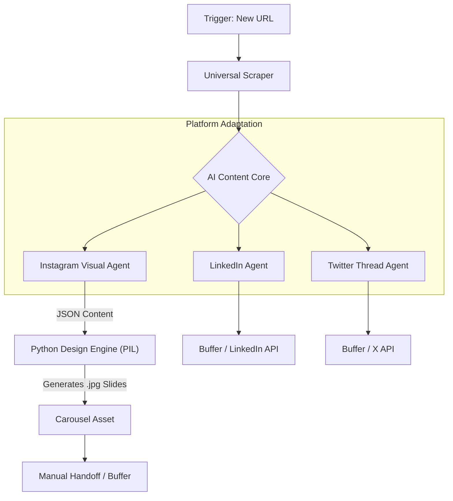

# 📢 Social Media Omni-Agent

> **Turn one Blog Post or YouTube Video into a week's worth of content for LinkedIn, X (Twitter), and Instagram.**

## 📖 Executive Summary
Creating content for multiple platforms is exhausting. You have to write professional text for LinkedIn, punchy threads for X, and design visual slides for Instagram.

This agent automates the entire "Repurposing Pipeline." Give it one URL, and it uses AI to extract the core ideas, rewrite them for each specific platform psychology, and even **programmatically designs the Instagram Carousel images** using Python.

**Key Features:**
* **Universal Scraper:** Reads text from any Blog or YouTube transcript.
* **Platform-Specific AI:** Uses different "System Prompts" for LinkedIn (Viral/Professional) vs. Twitter (Threads).
* **Python Design Engine:** Generates 1080x1350 Instagram slides locally—no Canva required.

---

## 🏗️ System Architecture



---

## ⚖️ Architecture Comparison

| Feature | 🚀 Pro Architecture (Cloud) | 💻 Local Architecture (Free) |
| :--- | :--- | :--- |
| **Best For** | Business/Agencies needing auto-posting | Creators on a budget |
| **Input Source** | RSS Feed / Webhook | Manual URL Paste |
| **Scraper** | **Zyte / ScraperAPI** (Reliable) | **HTTP Request** (Simple HTML) |
| **Content AI** | **GPT-4o** (Best Nuance) | **Gemini 1.5 Flash** (Free) |
| **Carousel Design** | **Bannerbear API** ($49/mo) | **Local Python Script** ($0) |
| **Posting Method** | **Buffer / LinkedIn API** (Auto) | **Discord/Slack Notification** (Review) |
| **Est. Cost** | ~$20/mo (API costs) | **$0.00** |

---

## 🚀 Option A: The Pro Workflow (Buffer Integration)

This version connects to Buffer to handle the complex posting APIs for you.

### 📥 Installation
1.  **[Download pro_workflow.json](./pro_workflow.json)**
2.  Import into n8n.
3.  **Requirements:**
    * **OpenAI API Key**
    * **Buffer Account** (Free plan works for 3 channels)

---

## 💻 Option B: The Local Workflow (Zero Cost)

This version generates all the text and **creates the actual image files** on your computer, then sends a Discord/Slack message with the files ready to drag-and-drop.

### 📥 Installation
1.  **[Download local_workflow.json](./local_workflow.json)**
2.  Import into n8n.

### ⚙️ Python Setup (The Design Engine)
This script uses the `Pillow` library to draw text on images.

1.  **Install Dependencies:**
    ```bash
    pip install Pillow
    ```

2.  **Setup Scripts:**
    * Ensure `carousel_generator.py` is in the `scripts/` folder.
    * **Font:** The script uses a default system font. For better results, download a `.ttf` font (like Roboto-Bold) and place it in the `scripts/` folder, then update the `FONT_PATH` in the python file.

3.  **Configure n8n:**
    * Open the **"Execute Python"** node in the workflow.
    * Update the `scriptPath` to match your local folder structure.

---

## 🔧 Troubleshooting

**Q: The Python script fails with "OSError: cannot open resource".**
**A:** This means it can't find the font file. Edit `carousel_generator.py` and change `FONT_PATH` to `"arial.ttf"` (Windows) or `"/Library/Fonts/Arial.ttf"` (Mac), or provide a full path to a downloaded font.

**Q: The Scraper returns empty text.**
**A:** Some sites block simple scrapers. Try using a "Readability" API or copy-paste the text manually into the Trigger node for testing.