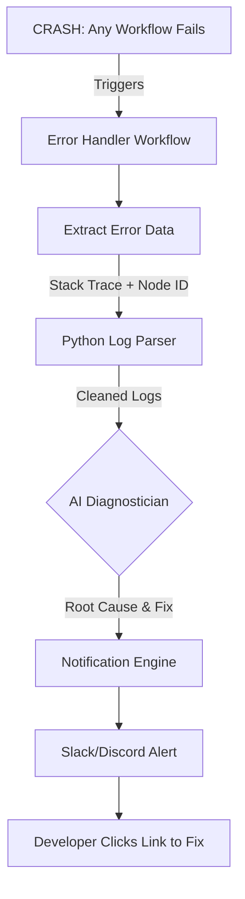

# 🚑 AI Error Handler (Self-Healing System)

> **A global "Safety Net" workflow that catches crashes, diagnoses the root cause with AI, and suggests fixes via Slack/Discord.**

## 📖 Executive Summary
In production automation, things break. APIs change, rate limits are hit, and websites block scrapers. Instead of waking up to a generic "Workflow Failed" email, this module acts as a Tier 1 Support Engineer.

It automatically triggers whenever *any* workflow in your n8n instance fails. It parses the cryptic error logs (Stack Trace), sends them to an LLM to explain the error in plain English, and provides a direct link to the failing node.

**Key Features:**
* **Global Catch-All:** Uses the n8n `Error Trigger` node to monitor your entire instance.
* **Intelligent Diagnosis:** Uses AI to convert "JSON parse error at line 1" into "The API returned HTML instead of JSON. You might be blocked."
* **Smart Alerting:** Sends color-coded alerts to Slack/Discord with "One-Click Fix" links.

---

## 🏗️ System Architecture

---

## ⚖️ Architecture Comparison

| Feature | 🚀 Pro Architecture (Cloud) | 💻 Local Architecture (Free) |
| :--- | :--- | :--- |
| **Best For** | Teams using Slack/PagerDuty | Solo Devs using Discord |
| **AI Model** | **GPT-4o** (Deep Code Analysis) | **Gemini 1.5 Flash** (Fast & Free) |
| **Log Parsing** | **n8n Code Node** (JavaScript) | **Local Python Script** (Regex) |
| **Alerting** | **Slack Block Kit** (Interactive) | **Discord Webhook** (Simple Embed) |
| **Est. Cost** | ~$2.00/mo (API usage) | **$0.00** |

---

## 🚀 Option A: The Pro Workflow (Slack + GPT-4o)

This version sends a beautiful, interactive "Block Kit" message to Slack.

### 📥 Installation
1.  **[Download pro_workflow.json](./pro_workflow.json)**
2.  Import into n8n.
3.  **Setup as Global Handler:**
    * Go to n8n **Settings** (bottom left) → **Workflows**.
    * Find **"Error Workflow"** dropdown.
    * Select **"Pro AI Error Handler"**.
4.  **Requirements:**
    * OpenAI API Key.
    * Slack API Token.

---

## 💻 Option B: The Local Workflow (Zero Cost)

This version uses a local Python script to clean up the messy error logs before sending them to Google Gemini (Free) and alerting you via Discord.

### 📥 Installation
1.  **[Download local_workflow.json](./local_workflow.json)**
2.  Import into n8n.
3.  **Setup as Global Handler:**
    * Go to n8n **Settings** → **Workflows**.
    * Select **"Local AI Error Handler"**.

### ⚙️ Python Setup (The Log Parser)
Raw n8n error JSON is massive. This script extracts only the relevant "Stack Trace" and "Node Parameters" to save AI token costs.

1.  **Setup Scripts:**
    * Ensure `log_parser.py` is in the `scripts/` folder.

2.  **Configure n8n:**
    * Open the **"Execute Python"** node.
    * Ensure the path points to `scripts/log_parser.py`.
    * **Discord Webhook:** Paste your Discord Webhook URL in the final node.

---

## 🔧 Troubleshooting

**Q: The Error Workflow never runs.**
**A:** You must set it as the **Global Error Workflow** in n8n Settings. Merely having it active in your list is not enough. It also only triggers when *other* workflows fail, not when you test it manually.

**Q: The AI explanation is cut off.**
**A:** The error log might be too huge. The `log_parser.py` script has a `MAX_CHARS` limit (default 2000) to prevent hitting token limits. You can adjust this in the Python file.